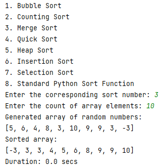

# Sorting Algorithms in Python
___
## Intro
In [computer science](https://en.wikipedia.org/wiki/Computer_science), a **sorting algorithm** is an algorithm that puts
elements of a list into an order. The most frequently
used orders are numerical order and lexicographical order, and either ascending or descending. Efficient sorting is 
important for optimizing the efficiency of other algorithms (such as search and merge algorithms) that require input 
data to be in sorted lists. Sorting is also often useful for canonicalizing data and for producing human-readable output.

Formally, the output of any sorting algorithm must satisfy two conditions:
- The output is in **monotonic** order (each element is no smaller/larger than the previous element, according to the 
- required order).
- The output is a **permutation** (a reordering, yet retaining all of the original elements) of the input.

For optimum efficiency, the input data should be stored in a data structure which allows random access rather than one 
that allows only sequential access.

## Algorithms used
- Bubble sort
- Counting sort
- Insertion sort
- Selection sort
- Quicksort
- Heapsort
- Merge sort
- Standard Python sort

## Instruction
- You need to select sorting algorithm
- You need to enter the number of elements for the array to be sorted
- Program displays the generated and sorted arrays

Example :point_down:

